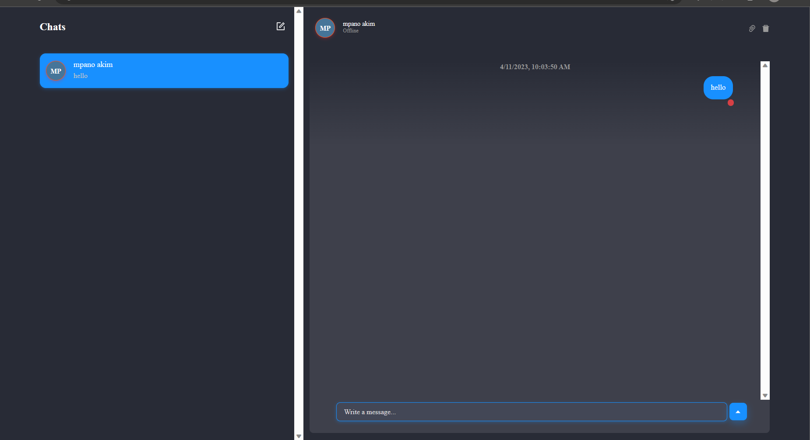

# Mychat App

<!-- PROJECT LOGO -->
 

  

  <h3 align="center">Mychat</h3>

  

    An awesome Chat with friends like whatsapp template!  
    open client readme and server readme for every step
  

